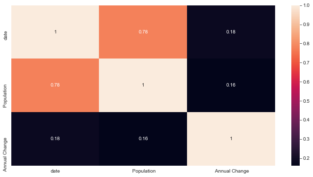
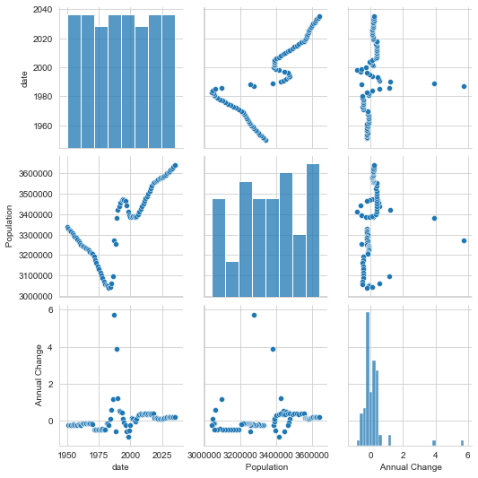
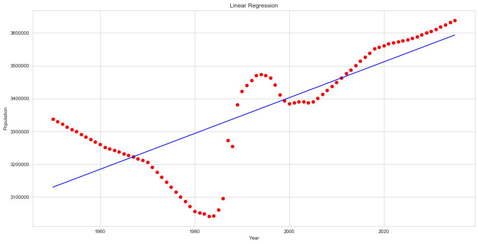
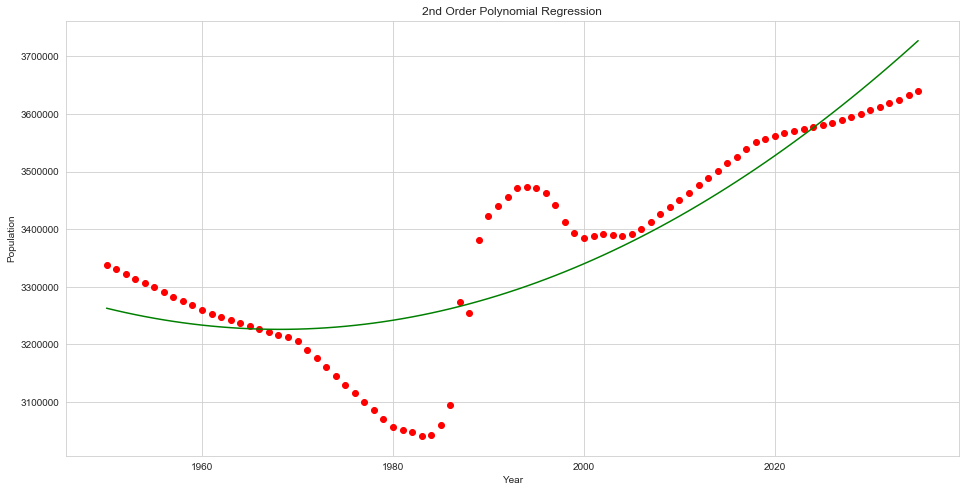
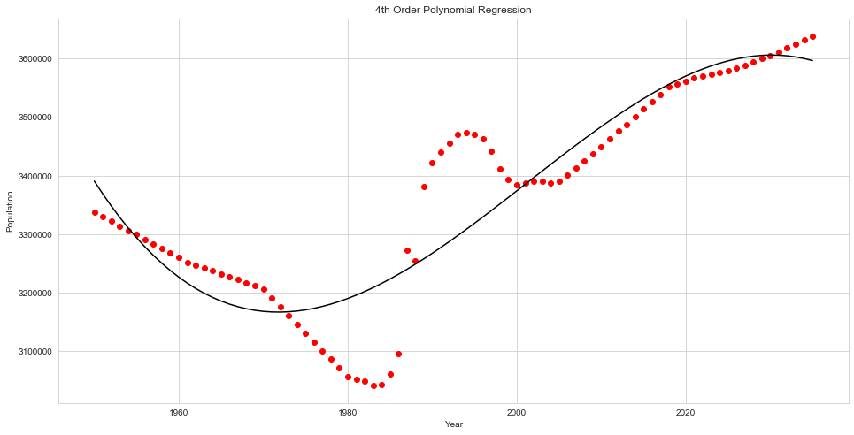
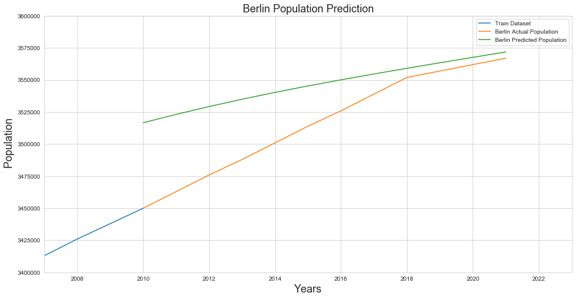

# Berlin 2035 Population Prediction with Linear Regression, Polynomial Regression and Long Short-Term Memory

     

Photo: I took it by SM-A520F.

## Problem Statement

The purpose of this study is to predict the population of Berlin in 2035. Population is a very important variable for city regulations and planning. Estimation processes about the population of Berlin, the capital of Germany, in 2035 were created in line with the regression models. Afterwards, the results were compared over the R² values. In addition, the forecast graph was drawn over the LSTM Network.

## Dataset

Dataset is downloaded from [macrotrends](https://www.macrotrends.net/cities/204296/berlin/population) website. Dataset has **3 columns** (Year, Population,  Annual Change) and **87 rows with the header**.

## Methodology

In this project, as stated in the title, results were obtained through three different methods. These methods are as respectively listed below:

 ***1. Linear Regression***
 
 ***2. Polynomial Regression***
 
 ***3. Long Short-Term Memory (LSTM)***

## Analysis

| # | Column | Non-Null Count | Dtype |
|--|--|--|--|
| 0 | date | 86 non-null | int64
| 1 | Population | 86 non-null | int64
| 2 | Annual Change | 85 non-null | float64

### Correlation Matrix

     

### Pair Plot

     

### **1.** Linear Regression 

     

### 2nd Order Polynomial Regression

     

### 4th Order Polynomial Regression

     

### LSTM

     

RMS(Difference between actual population and predicted population): 37224.69914068592
___

### Prediction

 **1.** Linear regression population prediction in 2035
 
 > **3593846.83239776**

 **2.** Polinomial regression (degree=2) population prediction in 2035
 
 > **3727080.32005322**

 **3.** Polinomial regression (degree=4) population prediction in 2035
 
 > **3596823.26672745**

### R² Values

 **1.** Linear regression
 
 > **0.6086274988056017**

 **2.** Polinomial regression (degree=2)
 
 > **0.7346609389955037**

 **3.** Polinomial regression (degree=4)
 
 > **0.825311510724274**

***Process took 8.878643035888672 seconds.***

## How to Run Code

Before running the code make sure that you have these libraries:

 - pandas 
 - matplotlib
 - seaborn
 - time
 - keras
 - sklearn
 - numpy
    
## Contact Me

If you have something to say to me please contact me: 

 - Twitter: [Doguilmak](https://twitter.com/Doguilmak)
 - Mail address: doguilmak@gmail.com
